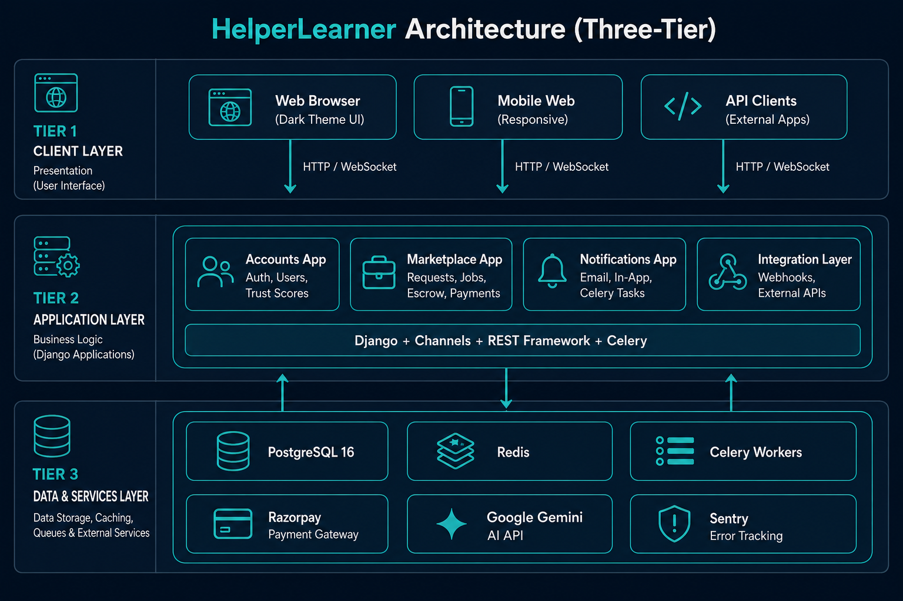
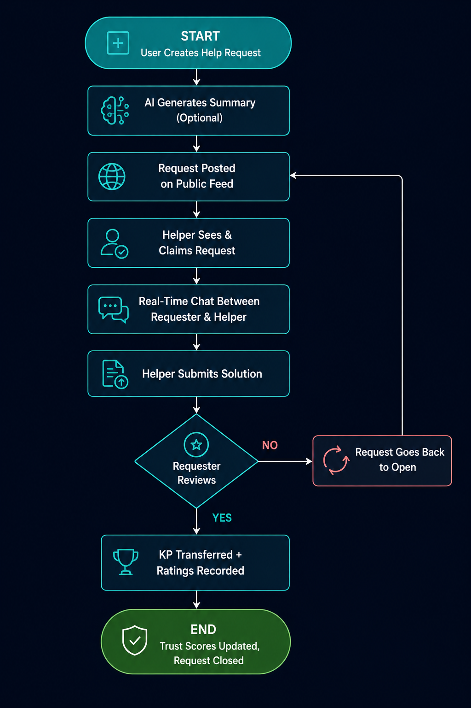
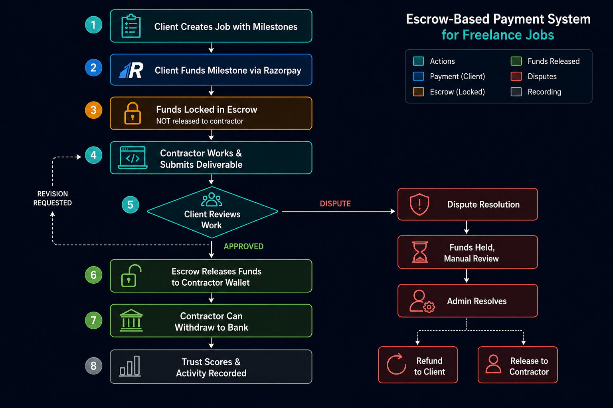
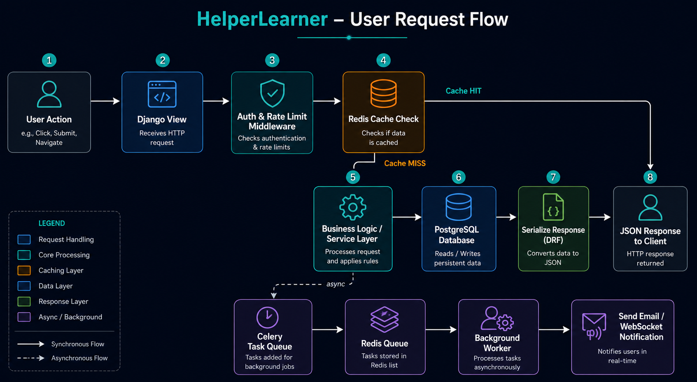
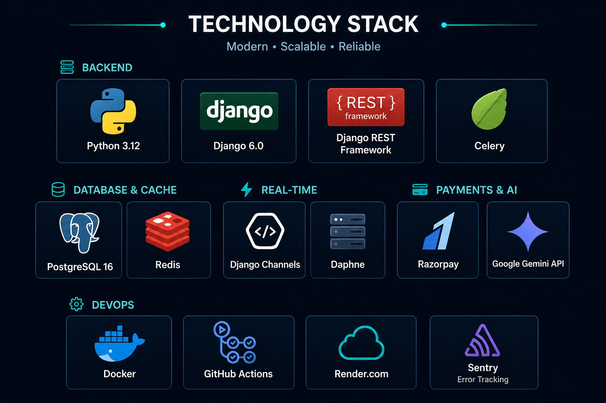

# HelperLearner - High Level Design (HLD)

## 1. Overview

HelperLearner is a **full-stack developer knowledge marketplace** built with Django. It connects developers to solve coding problems, earn Knowledge Points (KP), take on freelance jobs with real payments, and collaborate in team workspaces.

**Architecture Type:** Three-tier architecture with real-time capabilities
- **Tier 1:** Presentation Layer (UI/Templates + REST API)
- **Tier 2:** Business Logic Layer (Django Application)
- **Tier 3:** Data & External Services Layer (Database, Cache, Payment Gateway, AI)

---

## 2. System Architecture Diagram



```
┌─────────────────────────────────────────────────────────────────────────┐
│                         CLIENT LAYER                                    │
│  ┌──────────────────┐  ┌──────────────────┐  ┌──────────────────┐      │
│  │  Web Browser     │  │   Mobile Web     │  │   API Clients    │      │
│  │  (Dark Theme UI) │  │  (Responsive)    │  │  (External Apps) │      │
│  └──────────────────┘  └──────────────────┘  └──────────────────┘      │
└─────────────────────────────────────────────────────────────────────────┘
                              ↓↑ (HTTP/WebSocket)
┌─────────────────────────────────────────────────────────────────────────┐
│                   PRESENTATION & API LAYER                              │
│  ┌──────────────────────────────────────────────────────────────┐       │
│  │           Django + Channels (WebSocket Server)              │       │
│  ├──────────────┬──────────────┬──────────────┬────────────────┤       │
│  │  Templates   │  REST API    │  WebSocket   │   Auth Middleware│     │
│  │  (Dark CSS)  │  (DRF)       │  Consumers   │   (Session/API Key)   │
│  └──────────────┴──────────────┴──────────────┴────────────────┘       │
│  ├─ Django Middleware: CORS, Security, Logging, Rate Limiting         │
│  └─ Authentication: Session Auth + API Key + CSRF Protection          │
└─────────────────────────────────────────────────────────────────────────┘
                          ↓↑ (Application Layer)
┌─────────────────────────────────────────────────────────────────────────┐
│                  BUSINESS LOGIC LAYER (Django Apps)                    │
│  ┌──────────────┐ ┌──────────────┐ ┌──────────────┐ ┌─────────────┐   │
│  │   Accounts   │ │ Marketplace  │ │Notifications │ │ Integration │   │
│  │              │ │              │ │              │ │ (Webhooks)  │   │
│  │ • Auth       │ │ • Requests   │ │ • Email      │ │             │   │
│  │ • Users      │ │ • Jobs       │ │ • In-app     │ │ • Webhooks  │   │
│  │ • Trust      │ │ • Escrow     │ │ • Celery     │ │             │   │
│  │   Scores     │ │ • Payments   │ │   Tasks      │ │             │   │
│  │ • Skills     │ │ • AI         │ │              │ │             │   │
│  └──────────────┘ └──────────────┘ └──────────────┘ └─────────────┘   │
│  ├─ Services & Utilities (matching, moderation, search)               │
│  ├─ Business Rules (escrow, fraud detection, trust calculation)       │
│  └─ Background Processing (Celery tasks)                              │
└─────────────────────────────────────────────────────────────────────────┘
                            ↓↑ (Data Layer)
┌─────────────────────────────────────────────────────────────────────────┐
│                   DATA & SERVICES LAYER                                │
│  ┌─────────────────────┐  ┌─────────────────────┐  ┌────────────────┐  │
│  │   PostgreSQL DB     │  │   Redis Cache       │  │  Celery Broker │  │
│  │                     │  │                     │  │  (Task Queue)  │  │
│  │ • Users & Auth      │  │ • Session Cache     │  │                │  │
│  │ • Requests/Jobs     │  │ • Real-time Data    │  │ Email sending  │  │
│  │ • Payments/Escrow   │  │ • Rate Limiting     │  │ Cleanup tasks  │  │
│  │ • Chat Messages     │  │ • WebSocket Cache   │  │ Expiry checks  │  │
│  │ • Trust Signals     │  │ • Celery Results    │  │                │  │
│  └─────────────────────┘  └─────────────────────┘  └────────────────┘  │
│  ┌─────────────────────┐  ┌─────────────────────┐  ┌────────────────┐  │
│  │  Razorpay Payment   │  │  Google Gemini API  │  │  Sentry Error  │  │
│  │  Gateway            │  │  (AI Assistance)    │  │  Tracking      │  │
│  │                     │  │                     │  │                │  │
│  │ • Wallet top-up     │  │ • Auto-summaries    │  │ • Performance  │  │
│  │ • Milestone funding │  │ • Content check     │  │   Monitoring   │  │
│  │ • Dispute refunds   │  │ • Smart recommend.  │  │ • Error logs   │  │
│  └─────────────────────┘  └─────────────────────┘  └────────────────┘  │
└─────────────────────────────────────────────────────────────────────────┘
```

---

## 3. Core Components

### 3.1 **Presentation Layer**

| Component | Purpose | Technology |
|-----------|---------|-----------|
| **Web UI** | Dark-themed responsive templates | Django Templates + HTML/CSS (1600+ lines) |
| **REST API** | JSON endpoints for mobile/external apps | Django REST Framework (DRF) |
| **WebSocket** | Real-time chat, notifications, feed | Django Channels (Daphne) |
| **Authentication Middleware** | Session + API Key auth | Django Auth + custom API Key handler |

### 3.2 **Business Logic Layer**

**Four Main Django Apps:**

#### **a) Accounts App**
- User model (extended AbstractUser)
- Authentication & authorization
- Trust score calculation (multi-signal)
- Skill management
- GDPR data export
- User preferences & notifications

#### **b) Marketplace App** (Core - 30+ models)
- **Help Requests:** Post, claim, resolve, rate
- **Freelance Jobs:** Create, milestone-based workflow
- **Escrow System:** Lock funds → Release on approval
- **Payments:** Razorpay integration, wallet transfers
- **AI Matching:** Helper recommendations based on skills/trust
- **Content Moderation:** Pattern detection + Gemini classification
- **Search:** Full-text search via PostgreSQL SearchVector
- **Workspaces:** Mini-Jira with sprints and boards

#### **c) Notifications App**
- Email sending via Celery workers
- In-app notification creation
- Template management
- Task scheduling (expiry, SLA reminders)

#### **d) Integration Layer**
- Webhooks (outgoing & incoming Razorpay)
- External API calls
- WebSocket event broadcasting

### 3.3 **Data & Services Layer**

| Service | Purpose | Technology |
|---------|---------|-----------|
| **Primary Database** | Persistent data storage | PostgreSQL 16 |
| **Cache Layer** | Session cache, real-time data | Redis |
| **Task Queue** | Background job processing | Celery + Redis |
| **Payment Gateway** | Real INR transactions | Razorpay API |
| **AI Service** | Smart recommendations & moderation | Google Gemini API |
| **Error Tracking** | Production monitoring | Sentry |
| **Email Service** | Transactional & notification emails | SMTP via Celery |

---

## 4. Key Workflows (Data Flow)

### **Workflow 1: Help Request Lifecycle**
```
User Creates Request
    ↓
AI generates summary (optional)
    ↓
Request posted on feed
    ↓
Helper sees & claims request
    ↓
Chat between requester & helper
    ↓
Helper submits solution
    ↓
Requester reviews & approves
    ↓
KP transferred + ratings recorded
    ↓
Trust scores updated
```



### **Workflow 2: Freelance Job Payment (Escrow)**
```
Client creates Job with milestones
    ↓
Client funds first milestone via Razorpay
    ↓
Funds held in escrow (not released to contractor)
    ↓
Contractor works & submits work
    ↓
Client approves milestone
    ↓
Escrow releases funds to contractor wallet
    ↓
Contractor can withdraw to bank
    ↓
Trust scores & activity recorded
```



### **Workflow 3: Real-Time Chat**
```
User sends message in chat thread
    ↓
WebSocket pushes to Redis
    ↓
Channels broadcasts to connected clients
    ↓
In-app notification created
    ↓
Email notification sent (if enabled)
    ↓
Activity feed updated
```

---

## 5. Data Flow Diagram



```
Request/Response Flow:
  User Action → Django View → Business Logic → DB Query → Response
                    ↓
             Middleware (Auth, CORS, Logging)
                    ↓
             Rate Limiter, Brute-force Protection
                    ↓
             Cache Hit Check (Redis)
                    ↓
             Database Operation
                    ↓
             Serialize Response (DRF)
                    ↓
             Send to Client

Asynchronous Flow:
  User Action → Celery Task Created → Redis Queue
                                           ↓
                                    Celery Worker picks up
                                           ↓
                                    Process (send email, etc.)
                                           ↓
                                    Store result in Redis
                                           ↓
                                    WebSocket notifies client
```

---

## 6. External Integrations

### **6.1 Razorpay Payment Gateway**
- Wallet top-ups
- Milestone funding
- Dispute refunds
- Webhook handling (HMAC signed)

### **6.2 Google Gemini API**
- Auto-summarize help requests
- Content moderation (safe/flagged/blocked)
- Helper matching & skill recommendations
- Request drafting assistance

### **6.3 Email Service**
- Transactional emails (password reset, payments)
- Notification emails (request updates, chat, jobs)
- Scheduled reminders (SLA, expiry)
- Rate limiting per user

### **6.4 Sentry Error Tracking**
- Capture exceptions in production
- Performance metrics
- Release tracking

---

## 7. Security Architecture

```
Multi-Layer Security:

1. Transport Layer:
   └─ HTTPS/TLS encryption
   
2. Authentication:
   ├─ Session-based (cookies, CSRF token)
   └─ API Key authentication (hashed)

3. Authorization:
   ├─ Permission-based (Django permissions)
   ├─ Object-level (user ownership checks)
   └─ Role-based (admin, helper, requester)

4. Data Protection:
   ├─ Hashed passwords (PBKDF2)
   ├─ Encrypted sensitive data (payment tokens)
   └─ PII data export (GDPR compliance)

5. Fraud Detection:
   ├─ Trust score multi-signal system
   ├─ Suspicious pattern detection
   ├─ Rate limiting (100/day anon, 1000/day auth)
   └─ Brute-force lockout (django-axes)

6. Input Validation:
   ├─ Server-side validation (DRF serializers)
   ├─ Content moderation (Gemini + regex)
   └─ SQL injection prevention (ORM)
```

---

## 8. Deployment Architecture

### **Current Deployment (Render.com)**
```
Render Web Service (Django + Gunicorn)
    ↓
Render PostgreSQL Database
    ↓
Redis (for cache/sessions)
    ↓
Celery Workers (background tasks)
```

### **Docker Stack (Self-hosted)**
```
nginx (reverse proxy)
    ↓
Django Web Service (Gunicorn)
    ↓
PostgreSQL Container
    ↓
Redis Container
    ↓
Celery Worker Containers
```

### **CI/CD Pipeline**
```
GitHub Push
    ↓
GitHub Actions triggered
    ↓
Run Tests (Django test suite, 197 passing)
    ↓
Lint & Format Checks (flake8, black)
    ↓
Deploy checks
    ↓
Deploy to Render.com
```

---

## 9. Technology Stack Summary



| Layer | Technology |
|-------|-----------|
| **Language** | Python 3.12 |
| **Framework** | Django 6.0.2 |
| **API** | Django REST Framework 3.16 |
| **Real-time** | Django Channels 4.3 |
| **Database** | PostgreSQL 16 |
| **Cache** | Redis 5.2 |
| **Task Queue** | Celery 5.4 |
| **HTTP Server** | Gunicorn 25.1 |
| **WebSocket** | Daphne via Channels |
| **Payments** | Razorpay 2.0 |
| **AI** | Google Gemini API |
| **Error Tracking** | Sentry 2.23 |
| **Rate Limiting** | django-ratelimit 4.1 |
| **Security** | django-axes 6.3 |
| **Container** | Docker & docker-compose |
| **CI/CD** | GitHub Actions |

---

## 10. Scalability Considerations

**Horizontal Scaling:**
- Multiple Gunicorn workers (stateless)
- Multiple Celery workers (distributed)
- Redis cluster for caching

**Database Optimization:**
- PostgreSQL connection pooling
- Query optimization & indexes
- Read replicas for analytics

**Performance:**
- Frontend caching (CDN for static files)
- API response caching (Redis)
- WebSocket optimization (Channels layers)

---

## 11. Monitoring & Observability

- **Error Tracking:** Sentry
- **Logs:** Django logging + application logger
- **Metrics:** Request count, response time, error rate
- **Health Checks:** Periodic DB/Redis connectivity tests
- **Alerts:** Sentry alerts for critical errors

---

## Summary

HelperLearner is a **3-tier, microservices-ready architecture** with:
- ✅ Stateless application layer (scalable)
- ✅ Persistent data layer (PostgreSQL)
- ✅ Real-time capabilities (WebSockets)
- ✅ Async processing (Celery)
- ✅ Secure payments (Razorpay escrow)
- ✅ AI-powered features (Gemini)
- ✅ Multi-layer security
- ✅ Production-ready monitoring (Sentry)

This design supports growth from 100 to 100,000+ users with minimal refactoring.
