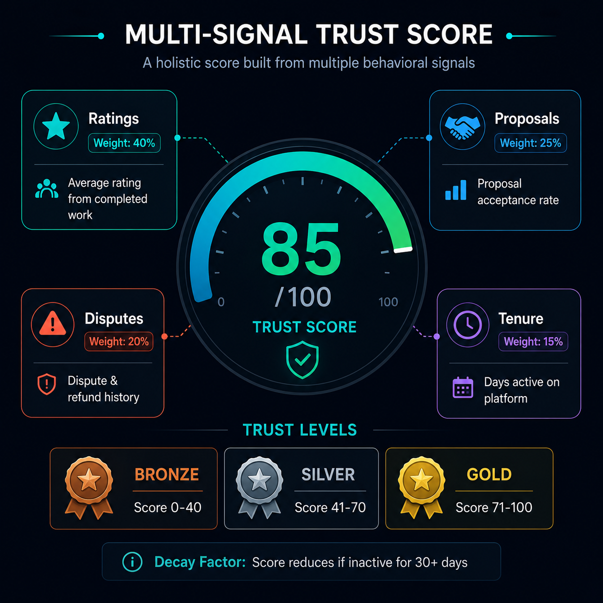

# HelperLearner - Low Level Design (LLD)

## 1. Overview

This document describes the detailed class structure, relationships, and design patterns used in HelperLearner. It serves as a blueprint for developers implementing features and maintaining the codebase.

---

## 2. Core Entity Models & Relationships

### **2.1 User Authentication & Profile System**

```
┌─────────────────────────────────────────┐
│         CustomUser (Django AbstractUser)│
├─────────────────────────────────────────┤
│ Attributes:                              │
│ - user_id: PK                            │
│ - username: Unique                       │
│ - email: Unique                          │
│ - password: Hashed                       │
│ - bio: Text (max 500)                    │
│ - knowledge_points: Integer (default 100)│
│ - wallet_inr: Decimal (2 places)         │
│ - trust_score: Float                     │
│ - is_suspended: Boolean                  │
│ - compliance_verified: Boolean           │
│ - created_at: DateTime                   │
│ - notification_preference: Choices       │
│ - ui_density: Choices                    │
│ - skills: ManyToMany → Skill             │
├─────────────────────────────────────────┤
│ Methods:                                 │
│ + allows_in_app_notifications()          │
│ + allows_email_notifications()           │
│ + is_currently_suspended()               │
│ + calculate_trust_score()                │
│ + get_active_requests()                  │
│ + get_completed_jobs()                   │
│ + can_withdraw_wallet()                  │
└─────────────────────────────────────────┘
         ↑         ↑         ↑
      1  │         │         │  *
  ┌──────┴──┐  ┌───┴────┐  ┌┴─────────┐
  │  Skill  │  │ TrustSignal │ Portfolio│
  └─────────┘  └────────┘  └──────────┘
```

**Relationships:**
- CustomUser "has many" HelpRequests (as requester)
- CustomUser "has many" HelpRequests (as helper) - through claim
- CustomUser "has many" FreelanceJobs (as client)
- CustomUser "has many" FreelanceJobs (as contractor)
- CustomUser "has many" Skills (many-to-many)
- CustomUser "has many" TrustSignals
- CustomUser "has many" ChatMessages
- CustomUser "has one" Portfolio

---

### **2.2 Help Request System**

```
┌──────────────────────────────────────────┐
│        HelpRequest (Core Model)          │
├──────────────────────────────────────────┤
│ Attributes:                               │
│ - id: PK                                  │
│ - requester: FK → CustomUser              │
│ - title: String (max 255)                 │
│ - description: Text                       │
│ - kp_bounty: Integer (1-1000)             │
│ - status: Choices (open/claimed/resolved) │
│ - difficulty: Choices (easy/med/hard)     │
│ - tags: String (comma-separated)          │
│ - created_at: DateTime                    │
│ - claimed_by: FK → CustomUser (nullable)  │
│ - claimed_at: DateTime (nullable)         │
│ - resolved_at: DateTime (nullable)        │
│ - ai_summary: Text (auto-generated)       │
│ - search_vector: SearchVector             │
├──────────────────────────────────────────┤
│ Methods:                                  │
│ + claim(user: CustomUser)                 │
│ + unclaim()                               │
│ + mark_resolved(solution: Solution)       │
│ + rate_solution(rating, comment)          │
│ + is_expired()                            │
│ + auto_generate_summary()                 │
│ + get_recommended_helpers()               │
│ + send_notifications()                    │
└──────────────────────────────────────────┘
    │         │           │          │
    │ 1  *    │           │          │
    ├────────┬┴─────┬─────┴──────┬───┴────┐
    │        │      │            │        │
┌───┴──┐  ┌──┴───┐ ┌┴────────┐  ┌┴──────┐
│Solution
│  │  │Rating │ │Comment   │  │Activity│
└──────┘  └──────┘ └─────────┘  └────────┘
```

**Key Relationships:**
- HelpRequest → CustomUser (requester, many-to-one)
- HelpRequest → CustomUser (helper/claimed_by, many-to-one, nullable)
- HelpRequest "has many" Solutions
- HelpRequest "has many" Comments
- HelpRequest "has many" Ratings
- HelpRequest "has one" AIAssistanceLog (for tracking AI usage)

---

### **2.3 Freelance Job System with Escrow**

```
┌──────────────────────────────────────────┐
│      FreelanceJob (Paid Work)            │
├──────────────────────────────────────────┤
│ Attributes:                               │
│ - id: PK                                  │
│ - client: FK → CustomUser                 │
│ - title: String                           │
│ - description: Text                       │
│ - budget_inr: Decimal                     │
│ - status: Choices (open/assigned/...)     │
│ - deadline: DateTime                      │
│ - created_at: DateTime                    │
│ - contractor: FK → CustomUser (nullable)  │
│ - contract_status: Choices                │
├──────────────────────────────────────────┤
│ Methods:                                  │
│ + accept_proposal(proposal_id)            │
│ + mark_milestone_complete(milestone_id)   │
│ + mark_milestone_approved(milestone_id)   │
│ + release_escrow_payment()                │
│ + handle_dispute()                        │
│ + cancel_job()                            │
└──────────────────────────────────────────┘
         │                   │
     1   │                   │   1
        ├────────────────────┤
        │                    │
    ┌───┴────────┐      ┌────┴────────┐
    │  Proposal  │      │  Milestone  │
    └────────────┘      └─────────────┘
         │                    │
    *    │                1   │  *
        ├────────────────────┤
        │                    │
    ┌───┴────────┐      ┌────┴────────┐
    │  Bid       │      │ Deliverable │
    └────────────┘      └─────────────┘
         │                    │
    *    │                *   │
         └────────────────────┘
         ┌────────────────────┐
         │   EscrowTransaction│
         └────────────────────┘
```

**Relationships:**
- FreelanceJob → CustomUser (client, many-to-one)
- FreelanceJob → CustomUser (contractor, many-to-one, nullable)
- FreelanceJob "has many" Proposals
- FreelanceJob "has many" Milestones
- Milestone "has many" Deliverables
- EscrowTransaction stores: (amount, status, milestone_id, release_date)

---

### **2.4 Escrow & Payment System**

```
┌────────────────────────────────────────────┐
│      EscrowTransaction                     │
├────────────────────────────────────────────┤
│ Attributes:                                 │
│ - id: PK                                    │
│ - job: FK → FreelanceJob                    │
│ - milestone: FK → Milestone                 │
│ - amount_inr: Decimal                       │
│ - status: Choices (locked/released/refunded)│
│ - locked_at: DateTime                       │
│ - released_at: DateTime (nullable)          │
│ - razorpay_order_id: String                 │
│ - razorpay_payment_id: String (nullable)    │
│ - transaction_hash: UUID                    │
├────────────────────────────────────────────┤
│ Methods:                                    │
│ + lock_funds()                              │
│ + release_to_contractor()                   │
│ + refund_to_client()                        │
│ + mark_disputed()                           │
│ + verify_razorpay_payment()                 │
└────────────────────────────────────────────┘
        │               │              │
        └───────────────┼──────────────┘
                        │
            ┌───────────┴────────────┐
            │                        │
        ┌───┴─────────┐      ┌──────┴────┐
        │WalletTransaction
        │      │  │Dispute  │
        └───────┘      └──────────┘
```

**Relationships:**
- EscrowTransaction → FreelanceJob (many-to-one)
- EscrowTransaction → Milestone (many-to-one)
- WalletTransaction (for transfers between users)
- Dispute (for handling escrow-related disputes)

---

### **2.5 Trust & Reputation System**

```
┌────────────────────────────────────────┐
│      TrustSignal (Multi-Signal)        │
├────────────────────────────────────────┤
│ Attributes:                             │
│ - id: PK                                │
│ - user: FK → CustomUser                 │
│ - signal_type: Choices (rating, proposal,│
│                dispute, tenure, etc)    │
│ - score_delta: Integer (-10 to +20)     │
│ - related_object_id: Integer            │
│ - description: String                   │
│ - created_at: DateTime                  │
│ - expires_at: DateTime (nullable)       │
├────────────────────────────────────────┤
│ Methods:                                 │
│ + calculate_weighted_score()             │
│ + is_expired()                           │
│ + get_decay_value()  (aging factor)      │
└────────────────────────────────────────┘
          │
          │ many
┌─────────┴─────────┐
│                   │
┌────────────┐  ┌───────────┐
│  Rating    │  │ Proposal  │
└────────────┘  │ Response  │
     │          └───────────┘
     │ submitter
┌────┴──────┐
│CustomUser │
└───────────┘
```

**Trust Score Components:**
- Rating from completed work
- Proposal acceptance rate
- Dispute history
- Tenure bonus
- Activity frequency
- Escrow success rate

---

### **2.6 Real-Time Communication System**

```
┌────────────────────────────────────────┐
│      ChatThread                        │
├────────────────────────────────────────┤
│ Attributes:                             │
│ - id: PK                                │
│ - request: FK → HelpRequest (nullable)  │
│ - job: FK → FreelanceJob (nullable)     │
│ - workspace: FK → Workspace (nullable)  │
│ - participants: ManyToMany → CustomUser │
│ - created_at: DateTime                  │
│ - last_message_at: DateTime             │
│ - subject: String                       │
├────────────────────────────────────────┤
│ Methods:                                 │
│ + add_participant(user)                  │
│ + remove_participant(user)               │
│ + send_message(user, content)            │
│ + mark_read(user)                        │
│ + archive()                              │
│ + broadcast_to_participants()            │
└────────────────────────────────────────┘
         │              │
     *   │              │
        ┌┴──────────────┤
        │               │
    ┌───┴──────┐   ┌────┴──────┐
    │ChatMessage
    │    │  │ Notification
    │    │  │(in-app, email)
    └────┘  └───────────┘
         │ sender
       * │
    ┌────┴───────────┐
    │ CustomUser     │
    └────────────────┘
```

**Relationships:**
- ChatThread → HelpRequest (optional, many-to-one)
- ChatThread → FreelanceJob (optional, many-to-one)
- ChatThread → Workspace (optional, many-to-one)
- ChatThread → CustomUser (participants, many-to-many)
- ChatThread "has many" ChatMessages
- ChatMessage → CustomUser (sender, many-to-one)

---

### **2.7 Workspace & Collaboration (Mini-Jira)**

```
┌────────────────────────────────────────┐
│      Workspace (Team Space)            │
├────────────────────────────────────────┤
│ Attributes:                             │
│ - id: PK                                │
│ - name: String                          │
│ - owner: FK → CustomUser                │
│ - description: Text                     │
│ - members: ManyToMany → CustomUser      │
│ - created_at: DateTime                  │
├────────────────────────────────────────┤
│ Methods:                                 │
│ + add_member(user, role)                 │
│ + create_sprint()                        │
│ + create_board()                         │
│ + get_active_sprints()                   │
└────────────────────────────────────────┘
     │              │            │
 1   │          *   │        *   │
    ├────────────────┼──────────┐
    │                │          │
┌───┴────┐   ┌──────┴─────┐  ┌┴──────────┐
│ Sprint │   │ Board      │  │ Issue    │
└────────┘   └────────────┘  └──────────┘
    │              │              │
*   │          *   │          *   │
    │              │              │
┌───┴────┐   ┌──────┴─────┐  ┌┴──────────┐
│Task    │   │ Card       │  │ Comment  │
│(backlog)   │(swimlane)  │  │          │
└────────┘   └────────────┘  └──────────┘
    │              │
    └──────────────┘
    assigned_to (CustomUser)
```

**Relationships:**
- Workspace → CustomUser (owner, many-to-one)
- Workspace → CustomUser (members, many-to-many)
- Workspace "has many" Sprints
- Workspace "has many" Boards
- Sprint "has many" Tasks
- Board "has many" Cards
- Issue/Task → CustomUser (assigned_to, many-to-one)

---

### **2.8 AI & Moderation System**

```
┌────────────────────────────────────────┐
│   AIAssistanceLog                      │
├────────────────────────────────────────┤
│ Attributes:                             │
│ - id: PK                                │
│ - user: FK → CustomUser                 │
│ - request: FK → HelpRequest (nullable)  │
│ - assistance_type: Choices (summary,    │
│   match, suggest, moderate)             │
│ - input_tokens: Integer                 │
│ - output_tokens: Integer                │
│ - cost_usd: Decimal                     │
│ - created_at: DateTime                  │
│ - response: JSON                        │
│ - status: Choices (success, failed)     │
├────────────────────────────────────────┤
│ Methods:                                 │
│ + generate_summary()                     │
│ + get_recommended_helpers()              │
│ + moderate_content()                     │
│ + log_usage()                            │
└────────────────────────────────────────┘

┌────────────────────────────────────────┐
│   ContentFlag (Moderation)             │
├────────────────────────────────────────┤
│ Attributes:                             │
│ - id: PK                                │
│ - reported_by: FK → CustomUser          │
│ - content_type: Choices (request, job)  │
│ - object_id: Integer                    │
│ - reason: Choices (spam, hate, etc)     │
│ - description: Text                     │
│ - status: Choices (open, resolved)      │
│ - moderator_notes: Text                 │
│ - action_taken: String                  │
│ - created_at: DateTime                  │
├────────────────────────────────────────┤
│ Methods:                                 │
│ + get_content_object()                   │
│ + auto_classify() (Gemini)               │
│ + take_action()  (warn/delete/suspend)   │
└────────────────────────────────────────┘
```

---

### **2.9 Search & Discovery System**

```
┌────────────────────────────────────────┐
│   Search Infrastructure                │
├────────────────────────────────────────┤
│ Uses: PostgreSQL SearchVector+SearchRank│
│                                         │
│ Indexed Models:                         │
│ - HelpRequest (title, desc, tags)       │
│ - FreelanceJob (title, desc)            │
│ - CustomUser (bio, skills)              │
│                                         │
│ Query Processing:                       │
│ 1. Tokenize query                       │
│ 2. Convert to TSQuery                   │
│ 3. Full-text search on SearchVector     │
│ 4. Rank by SearchRank + metadata        │
│ 5. Return top 50 results                │
├────────────────────────────────────────┤
│ Advanced Filters:                       │
│ - By difficulty (easy/med/hard)         │
│ - By KP bounty range                    │
│ - By status (open/claimed)              │
│ - By date (newer first)                 │
│ - By skills/tags                        │
└────────────────────────────────────────┘
```

---

## 3. Class Diagram (UML Format)

```
ACCOUNT SYSTEM:
  CustomUser (Extended AbstractUser)
  ├─ Attributes: username, email, bio, kp, wallet, trust_score, skills[]
  ├─ Methods: calculate_trust_score(), can_withdraw(), get_active_requests()
  └─ Relations: 1-N with HelpRequest, FreelanceJob, Portfolio, ChatMessage

MARKETPLACE CORE:
  HelpRequest
  ├─ Attributes: requester, title, description, kp_bounty, status, difficulty
  ├─ Methods: claim(), unclaim(), resolve(), rate_solution()
  └─ Relations: 1-N with Solution, Comment, Rating, ChatThread

  FreelanceJob
  ├─ Attributes: client, contractor, title, budget_inr, status, deadline
  ├─ Methods: accept_proposal(), complete_milestone(), release_escrow()
  └─ Relations: 1-N with Proposal, Milestone, EscrowTransaction, ChatThread

  Milestone
  ├─ Attributes: job_fk, deliverable, amount_inr, due_date, status
  ├─ Methods: mark_complete(), get_escrow_status(), release_payment()
  └─ Relations: N-1 with FreelanceJob, 1-N with Deliverable, EscrowTransaction

TRUST & REPUTATION:
  TrustSignal
  ├─ Attributes: user, signal_type, score_delta, created_at, expires_at
  ├─ Methods: calculate_weighted_score(), get_decay_value()
  └─ Relations: N-1 with CustomUser

  Rating
  ├─ Attributes: rater, ratee, request/job, score, comment
  └─ Relations: N-1 with CustomUser, HelpRequest/FreelanceJob

PAYMENTS & ESCROW:
  EscrowTransaction
  ├─ Attributes: job, milestone, amount, status, razorpay_id
  ├─ Methods: lock_funds(), release_to_contractor(), refund_to_client()
  └─ Relations: N-1 with FreelanceJob, Milestone

  WalletTransaction
  ├─ Attributes: user, transaction_type, amount, description, created_at
  └─ Relations: N-1 with CustomUser

COMMUNICATION:
  ChatThread
  ├─ Attributes: request/job, participants[], created_at, subject
  ├─ Methods: send_message(), add_participant(), broadcast_to_participants()
  └─ Relations: M-N with CustomUser, 1-N with ChatMessage

  ChatMessage
  ├─ Attributes: thread, sender, content, created_at, edited_at, is_deleted
  └─ Relations: N-1 with ChatThread, CustomUser

  Notification
  ├─ Attributes: user, content_type, object_id, is_read, created_at
  └─ Relations: N-1 with CustomUser

AI & MODERATION:
  AIAssistanceLog
  ├─ Attributes: user, request, assistance_type, tokens_used, cost, status
  └─ Relations: N-1 with CustomUser, HelpRequest

  ContentFlag
  ├─ Attributes: reported_by, content_type, reason, status, action_taken
  ├─ Methods: auto_classify(), take_action()
  └─ Relations: N-1 with CustomUser
```

---

## 4. Design Patterns Used

### **4.1 Model Design Patterns**

| Pattern | Usage | Example |
|---------|-------|---------|
| **Entity-Relationship** | Core data models | CustomUser, HelpRequest, FreelanceJob |
| **Aggregate** | Grouping related entities | Milestone + Deliverable + EscrowTransaction |
| **Composite** | Hierarchical data | Workspace → Sprint → Task |
| **State Machine** | Status transitions | HelpRequest (open→claimed→resolved) |

### **4.2 Architectural Patterns**

| Pattern | Usage | Implementation |
|---------|-------|-----------------|
| **Layered** | Presentation → Business → Data | Views → Services → Models |
| **MVC** | Django MTV | Models + Templates + Views |
| **Repository** | Abstraction for data access | Django ORM QuerySets |
| **Observer** | Event notifications | Django signals |
| **Strategy** | Multiple implementations | Payment methods, moderation |

### **4.3 Behavioral Patterns**

| Pattern | Usage | Where |
|---------|-------|-------|
| **Callback** | Async notifications | Celery tasks, WebSocket |
| **Template Method** | Common workflows | Request lifecycle, Job completion |
| **Factory** | Object creation | Model instantiation via views |

---

## 5. Key Business Logic

### **5.1 Trust Score Calculation**



```python
class TrustScoreCalculator:
    """
    Multi-signal trust scoring:
    
    Components (weighted):
    - Rating Signal (40%): Average rating * tenure bonus
    - Proposal Signal (25%): Acceptance rate * response time
    - Dispute Signal (20%): Refund rate (lower is better)
    - Tenure Signal (15%): Days active (capped at 365)
    
    Formula:
    trust_score = (
        rating_component * 0.40 +
        proposal_component * 0.25 +
        (100 - dispute_component) * 0.20 +
        tenure_component * 0.15
    ) * decay_factor
    
    Decay Factor: Reduces score if no activity in 30+ days
    """
```

### **5.2 Escrow Release Workflow**

```python
class EscrowService:
    """
    Escrow Transaction Lifecycle:
    
    1. Client funds milestone (Razorpay payment)
    2. Amount locked in EscrowTransaction (status: LOCKED)
    3. Contractor delivers work
    4. Client reviews and approves milestone
    5. EscrowTransaction status → APPROVED
    6. Amount transferred to contractor wallet
    7. Contractor can withdraw to bank account
    
    Safety Mechanisms:
    - HMAC signature verification for Razorpay webhooks
    - Timeout refund: Auto-refund if not approved within SLA
    - Dispute handling: Hold amount if dispute raised
    """
```

### **5.3 AI-Powered Matching**

```python
class HelperMatcher:
    """
    Recommend helpers based on:
    1. Skill match (TF-IDF on skills + tags)
    2. Trust score (weighted by category)
    3. Success rate (completed jobs / total)
    4. Response time (avg hours to claim)
    5. Recency (activity in last 30 days)
    
    Score = (
        skill_score * 0.35 +
        trust_score * 0.30 +
        success_rate * 0.20 +
        response_bonus * 0.10 +
        activity_bonus * 0.05
    )
    """
```

---

## 6. Data Persistence Strategy

### **6.1 Model Indexing**

**Primary Indexes (for performance):**
- CustomUser: (knowledge_points, wallet_inr, trust_score, is_suspended)
- HelpRequest: (status, created_at, claimed_by)
- FreelanceJob: (status, client, contractor, deadline)
- ChatMessage: (thread_id, created_at)
- EscrowTransaction: (job_id, status, created_at)

**Search Indexes:**
- HelpRequest: SearchVector on (title, description, tags)
- FreelanceJob: SearchVector on (title, description)
- CustomUser: SearchVector on (bio, skills__name)

### **6.2 Constraints**

```sql
-- Data Integrity
CHECK knowledge_points >= 0
CHECK wallet_inr >= 0
CHECK kp_bounty BETWEEN 1 AND 1000
CHECK budget_inr > 0
CHECK trust_score BETWEEN 0 AND 100

-- Unique Constraints
UNIQUE(username)
UNIQUE(email)
UNIQUE(transaction_hash)  -- Prevent duplicate payments
```

---

## 7. API Method Signatures (Key Services)

```python
# Marketplace Service
class MarketplaceService:
    def create_help_request(requester, title, desc, kp) -> HelpRequest
    def claim_request(request_id, user) -> bool
    def submit_solution(request_id, user, solution_text) -> Solution
    def rate_and_close(request_id, rater, solution_id, rating) -> Rating
    
    def create_freelance_job(client, title, budget, deadline) -> FreelanceJob
    def submit_proposal(job_id, contractor, proposal_text) -> Proposal
    def accept_proposal(job_id, proposal_id) -> bool
    def complete_milestone(milestone_id, contractor) -> bool
    def approve_milestone(milestone_id, client) -> bool
    def release_escrow_payment(milestone_id) -> WalletTransaction

# Trust Service
class TrustService:
    def calculate_user_trust_score(user) -> float
    def add_trust_signal(user, signal_type, delta) -> TrustSignal
    def get_user_trust_history(user, days=30) -> List[TrustSignal]

# Payment Service
class PaymentService:
    def create_razorpay_order(amount, description) -> Order
    def verify_razorpay_payment(payment_id, signature) -> bool
    def transfer_to_wallet(user, amount, source) -> WalletTransaction
    def request_withdrawal(user, amount, bank_account) -> Withdrawal

# Search Service
class SearchService:
    def search_requests(query, filters) -> List[HelpRequest]
    def search_jobs(query, filters) -> List[FreelanceJob]
    def search_users(query, skills) -> List[CustomUser]

# Notification Service
class NotificationService:
    def notify_request_claimed(request_id, helper_id)
    def notify_milestone_approved(milestone_id, contractor_id)
    def send_email_notification(user, template, context)
    def broadcast_websocket_event(event_type, data)
```

---

## Summary

HelperLearner's LLD is built on:
- ✅ **Normalized database** with proper relationships
- ✅ **Clear separation of concerns** (models, services, views)
- ✅ **Scalable design patterns** (repository, strategy, observer)
- ✅ **Multi-signal trust scoring** for reputation
- ✅ **Secure escrow system** with Razorpay integration
- ✅ **Real-time capabilities** via WebSocket+Channels
- ✅ **AI-powered features** via Gemini API
- ✅ **Full-text search** via PostgreSQL
- ✅ **Async processing** via Celery

This design enables:
- Easy testing (each service isolated)
- Clear data flow (from API → service → model → DB)
- Simple feature addition (new models follow same patterns)
- Scalability (stateless services, optimized queries)
