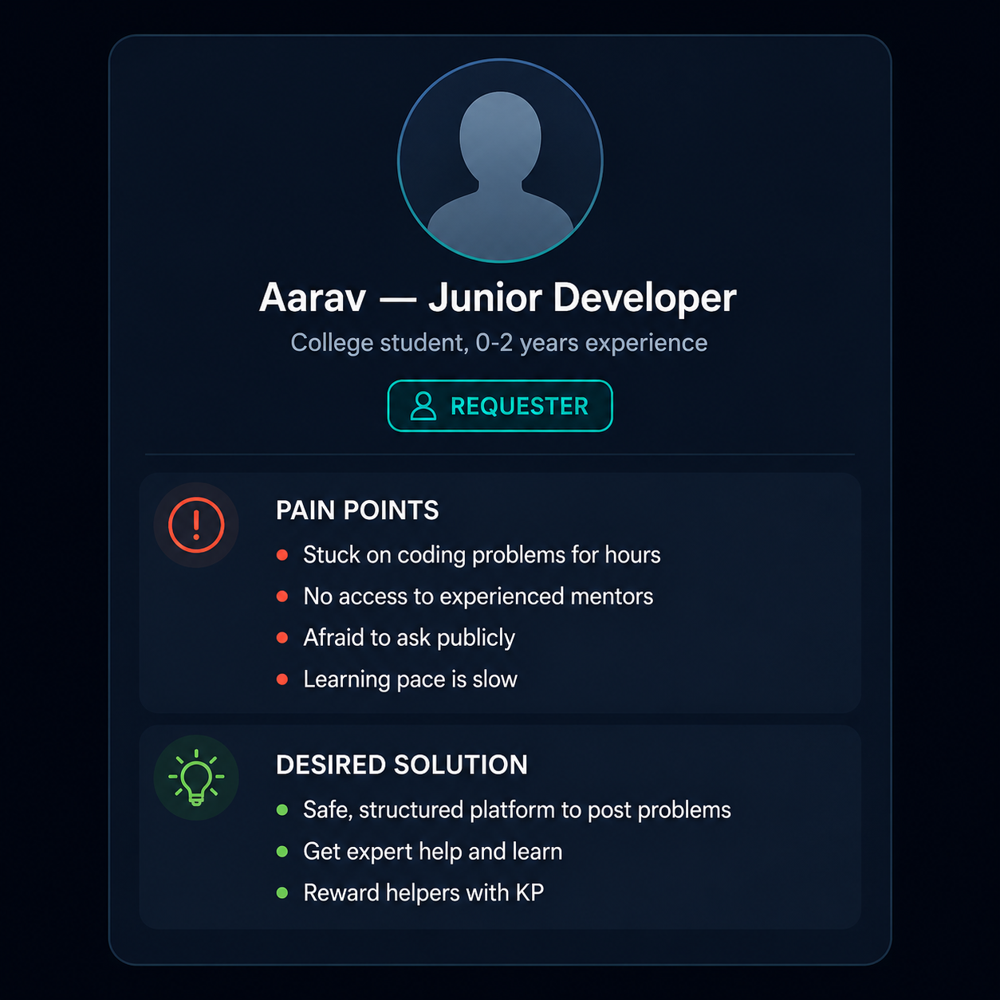
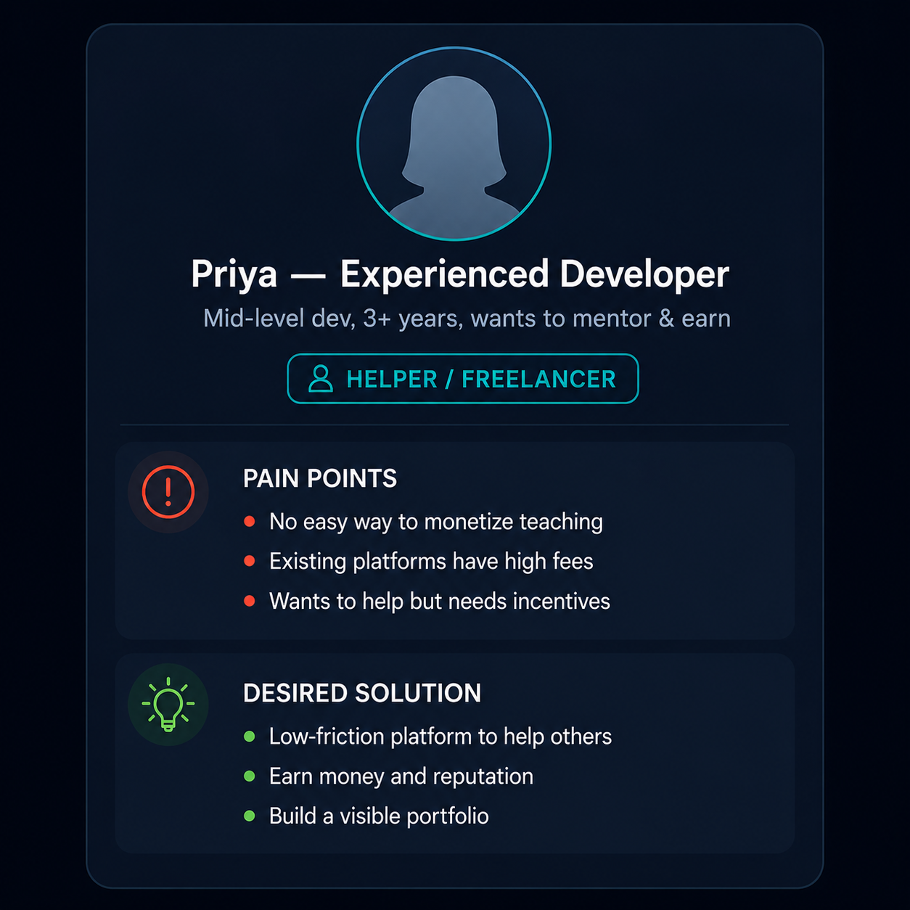
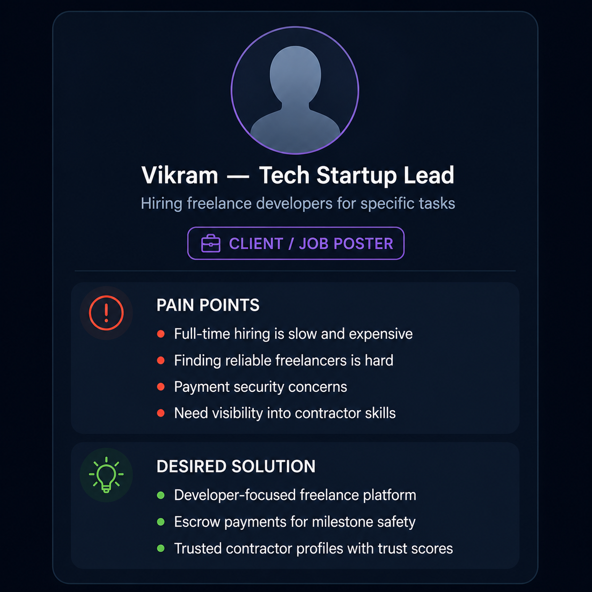

# HelperLearner - Problem Statement & Requirements

## 1. Problem Statement

### 1.1 The Core Problem

**"Developers face two critical challenges in their learning and freelancing journey:"**

#### Problem 1: Knowledge Silos & Blocked Learning
- Junior developers often get stuck on coding problems with no structured way to seek help
- Asking on social media (Reddit, Stack Overflow, WhatsApp groups) is random and unstructured
- Expert developers have no incentive or platform to help solve these problems
- Learning becomes slower, frustration builds, and talent is lost

#### Problem 2: Fragmented Freelance Job Market
- Developers looking for side income have to use platforms like Upwork (high fees: 20%)
- No platform designed specifically for developers with an India-first approach
- Existing platforms lack team collaboration features for tech projects
- Milestone-based payment systems don't build trust for longer projects

---

### 1.2 Target Users & Pain Points

#### **User Persona 1: Junior Developer (Requester)**

- **Profile:** College student or early-career dev (0-2 years experience)
- **Pain Points:**
  - Stuck on coding problems for hours/days
  - No access to experienced mentors
  - Afraid to ask for help publicly
  - Learning pace is slow
- **Desired Solution:** A safe, structured platform to post problems, get help, learn, and reward helpers

#### **User Persona 2: Experienced Developer (Helper)**

- **Profile:** Mid-level dev (3+ years) looking to earn extra or mentor
- **Pain Points:**
  - No easy way to monetize knowledge/teaching
  - Existing platforms have high fees and poor developer UX
  - Wants to help but needs incentives
- **Desired Solution:** Low-friction platform to help others, earn money/reputation, build portfolio

#### **User Persona 3: Tech Startup/Team Lead (Job Poster)**

- **Profile:** Hiring team needing freelance developers for specific tasks
- **Pain Points:**
  - Hiring full-time devs is slow and expensive
  - Finding reliable freelancers is hard on existing platforms
  - Payment security concerns with large projects
  - Need visibility into contractor skills/trust
- **Desired Solution:** Developer-focused freelance platform with escrow, team workspaces, and trusted contractor profiles

---

### 1.3 Existing Solutions & Their Gaps

| Existing Solution | Target Use Case | Gaps for HelperLearner |
|---|---|---|
| **Stack Overflow** | Knowledge Q&A | No incentive for answerers, no monetization, no trust system |
| **Upwork** | Freelancing | High fees (20%), not dev-optimized, poor collaboration |
| **Fiverr** | Micro-gigs | Low-quality gigs, no milestone-based escrow, not India-centric |
| **Discord Communities** | Peer help | Unstructured, no reputation system, no ownership |
| **Mentoring Platforms** | 1-1 mentoring | Expensive ($50-200/hr), not scalable, no team features |
| **GitHub Issues** | Bug bounties | Limited to open-source, no payment integration, narrow use case |

**Why HelperLearner Fits the Gap:**
- ✅ Built FOR developers, BY developers
- ✅ Combines help marketplace + freelancing + team collaboration
- ✅ Incentive structure (KP + INR) rewards both helpers and experienced devs
- ✅ India-first: Razorpay integration for INR payments, local pricing
- ✅ Trust-first: Escrow, trust scores, portfolio visibility
- ✅ Community-driven: Help requests, teams, social leaderboards

---

## 2. Functional Requirements

### 2.1 Core Marketplace - Help Requests

**FR1.1** Post Help Request
- User can create a help request with: title, description, difficulty level, tags, KP bounty
- System auto-generates AI summary (optional via Gemini)
- Request visible on public feed with search/filter
- Estimated completion time shown (based on difficulty)
- **Priority:** CRITICAL

**FR1.2** Claim & Work on Request
- Helper can claim open request (first-come-first-serve)
- Request status changes to "Claimed" (blocked for others)
- Requester and helper can chat in threaded chat
- Helper can post solution/code snippets
- **Priority:** CRITICAL

**FR1.3** Rate & Resolve Request
- Requester can approve/reject solution
- If approved: KP transferred to helper, ratings recorded
- If rejected: Request goes back to "Open" state
- Both can leave star ratings + comments
- Trust scores updated
- **Priority:** CRITICAL

**FR1.4** Help Request Lifecycle
- Auto-expiry: Requests open for 30 days, then archived
- Requester can cancel anytime (gets KP back)
- Helper can unclaim if not resolved within SLA
- Activity feed shows all actions
- **Priority:** HIGH

### 2.2 Freelance Jobs with Escrow

**FR2.1** Create Freelance Job
- Client posts job with: title, description, budget (INR), deadline, skills needed
- Can set multiple milestones (e.g., 30% upfront, 70% on completion)
- Public listing on jobs feed
- Can close/reopen postings
- **Priority:** CRITICAL

**FR2.2** Propose & Accept Contractor
- Contractors can submit proposals with bid amount, delivery timeline
- Client can view contractor profile (ratings, trust score, portfolio)
- Client accepts one proposal, others notified
- Contract formalizes terms and milestones
- **Priority:** CRITICAL

**FR2.3** Escrow-Based Payment Flow
- Client funds first milestone via Razorpay
- Amount locked in escrow (not released yet)
- Contractor delivers work for milestone
- Client reviews deliverable (approve/request revision)
- On approval: Amount released to contractor wallet
- Contractor can withdraw to bank account or keep for future jobs
- **Priority:** CRITICAL

**FR2.4** Milestone Management
- Multiple milestones per job (e.g., 3-stage project)
- Each milestone has: deliverable description, amount, deadline
- Clear workflow: Funded → In Progress → Delivered → Approved → Paid
- SLA tracking (% jobs completed on time)
- **Priority:** HIGH

### 2.3 KP Economy

**FR3.1** Knowledge Points (KP) System
- Each user starts with 100 KP
- Earn KP by: solving help requests, getting positive ratings, daily login bonus
- Spend KP by: posting help requests
- KP bounty can be 1-1000 per request
- Leaderboard ranking based on KP balance
- **Priority:** HIGH

**FR3.2** KP Transfer & Ledger
- KP transfers recorded in transaction log
- User can view KP history (earned, spent, current balance)
- Cannot go negative (system prevents overspend)
- Weekly KP claim bonus (free 10 KP/week for active users)
- **Priority:** HIGH

### 2.4 Real-Time Communication

**FR4.1** Real-Time Chat
- WebSocket-based chat for help requests, jobs, workspaces
- Typing indicators, read receipts
- Message edit/delete for own messages
- Mentions (@user) with notifications
- **Priority:** HIGH

**FR4.2** Notifications
- In-app notifications (bell icon, pop-ups)
- Email notifications (on demand or daily digest)
- WebSocket push for real-time alerts
- User can customize notification preferences (both/email/in-app/none)
- **Priority:** HIGH

### 2.5 Workspaces (Mini-Jira for Teams)

**FR5.1** Create & Manage Workspace
- Team lead creates workspace (name, description)
- Invite members (email invite + accept flow)
- Set member roles (owner, maintainer, developer)
- Workspace has: boards, sprints, issues, activity feed
- **Priority:** MEDIUM

**FR5.2** Kanban Board & Sprint Planning
- Drag-drop board with swimlanes (To-Do, In Progress, Done)
- Create sprints with start/end dates
- Assign tasks to team members
- Sprint burndown chart showing daily progress
- **Priority:** MEDIUM

**FR5.3** Workspace Chat & Collaboration
- Separate chat thread per workspace
- Link issues/pull requests to chat discussions
- @mentions for visibility
- **Priority:** MEDIUM

### 2.6 Payments & Wallet

**FR6.1** Razorpay Integration
- Wallet top-up via Razorpay (minimum 100 INR)
- Auto-verified payment webhook (HMAC signed)
- Instant INR credit to wallet on success
- Failed payment notifications
- **Priority:** CRITICAL

**FR6.2** Wallet Management
- Display current wallet balance (INR + KP)
- Transaction history (all inflows/outflows)
- Withdrawal to bank account (manual approval for first withdrawal)
- Minimum withdrawal: 500 INR
- Processing time: 2-5 business days
- **Priority:** HIGH

**FR6.3** Payment for Freelance Jobs
- Escrow holds funds until milestone approval
- Automatic transfer to contractor on approval
- Refund to client if job cancelled
- Dispute resolution (hold funds, manual review)
- **Priority:** CRITICAL

### 2.7 Trust & Reputation

**FR7.1** Trust Score System
- Multi-signal trust score (0-100):
  - Ratings from completed work (40%)
  - Proposal acceptance rate (25%)
  - Dispute history (20%)
  - Tenure (15%)
  - Activity frequency (bonus)
- Public display on user profile
- Badge system (Bronze/Silver/Gold based on score)
- **Priority:** HIGH

**FR7.2** Ratings & Reviews
- 5-star rating + comment for help requests and jobs
- Only users who worked together can rate
- Ratings public on profile
- Average rating calculated and displayed
- **Priority:** HIGH

**FR7.3** Fraud Detection & Suspension
- Pattern detection: suspicious claims, rapid KP transfers, fake reviews
- Automated risk flagging
- Manual review by moderators
- Account suspension (temporary or permanent)
- Appeal process
- **Priority:** HIGH

### 2.8 Search & Discovery

**FR8.1** Full-Text Search
- Search across: requests, jobs, users, skills
- Filter by: difficulty, KP bounty, status, date, skills
- Relevance ranking (PostgreSQL SearchRank)
- Pagination with 20 results/page
- **Priority:** HIGH

**FR8.2** Recommendations
- AI-powered helper suggestions (matched by skills + trust)
- Job recommendations (matched to user skills)
- Related requests (similar tags/difficulty)
- **Priority:** MEDIUM

### 2.9 Admin & Moderation

**FR9.1** Content Moderation
- Report button on all requests/jobs
- Moderation queue for reviews
- Auto-classify content (safe/flagged/blocked) via Gemini
- Pattern detection (spam, hate speech, scams)
- **Priority:** HIGH

**FR9.2** Admin Dashboard
- View all users, requests, jobs, transactions
- Suspend/unsuspend users
- Approve/reject disputed transactions
- View analytics (DAU, transactions, revenue)
- **Priority:** MEDIUM

---

## 3. Non-Functional Requirements

### 3.1 Performance

**NFR1.1** Response Time
- API endpoints: < 2 seconds for 99% of requests
- Chat messages: < 500ms WebSocket delivery
- Search results: < 1 second for typical queries
- Page load: < 3 seconds (cold), < 1 second (cached)

**NFR1.2** Throughput
- Support 1000+ concurrent WebSocket connections
- Handle 500+ requests/second at peak
- 100,000+ daily active users (scaling target)
- Process 1,000 Razorpay webhooks/day

**NFR1.3** Caching
- Redis cache for: user sessions, leaderboards, search results
- CDN for static assets (CSS, JS, images)
- Database query optimization (indexes, denormalization where needed)

### 3.2 Reliability & Availability

**NFR2.1** Uptime SLA
- 99.5% uptime (11 hours downtime/month max)
- Automated health checks every 5 minutes
- Incident response < 1 hour for critical issues

**NFR2.2** Data Backup & Recovery
- Daily automated PostgreSQL backups
- Point-in-time recovery capability
- Backup storage in S3 (separate region)
- Recovery time objective: < 1 hour

**NFR2.3** Scalability
- Horizontal scaling: stateless Django instances
- Auto-scaling based on CPU/memory
- Database read replicas for analytics queries
- CDN for traffic spike handling

### 3.3 Security

**NFR3.1** Authentication & Authorization
- Password hashing: PBKDF2 (Django default)
- Session timeout: 30 days
- API key authentication with hashed keys
- CSRF token on all POST requests
- Brute-force protection: 5 failed attempts = 30 min lockout

**NFR3.2** Data Protection
- HTTPS/TLS encryption (all data in transit)
- PII fields encrypted at rest (optional)
- SQL injection prevention (ORM + parameterized queries)
- XSS prevention (template auto-escaping)
- CSRF protection on all state-changing operations

**NFR3.3** Payment Security
- PCI-DSS compliance via Razorpay (no direct credit card storage)
- HMAC signature verification for webhooks
- Idempotent payment operations (prevent double-charging)
- Escrow prevents fraud (funds not released until approval)

**NFR3.4** Audit & Logging
- Log all user actions (login, money transfer, content creation)
- Retain logs for 90 days
- Admin cannot delete user data (compliance)
- GDPR export: user can download all personal data

### 3.4 Usability

**NFR4.1** User Experience
- Dark theme (eye-friendly, modern)
- Responsive design (mobile-first)
- Accessibility: WCAG 2.1 AA compliance
- Loading indicators for async operations
- Clear error messages with solutions

**NFR4.2** Localization
- Interface in English (primary)
- Future: Hindi, regional languages
- INR currency (India-first pricing)
- IST timezone

### 3.5 Maintainability

**NFR5.1** Code Quality
- Python code style: PEP 8 (Black formatter)
- Test coverage target: > 80% (unit + integration tests)
- Documentation: docstrings on all classes/methods
- Code reviews before merge (GitHub PR required)

**NFR5.2** Deployment & DevOps
- Docker containerization
- CI/CD via GitHub Actions
- Zero-downtime deployments (rolling update)
- Database migrations tested before production

**NFR5.3** Monitoring
- Error tracking: Sentry
- Performance metrics: request latency, DB query time
- Business metrics: DAU, transaction count, revenue
- Alerts for: error spike, downtime, payment failures

---

## 4. Use Cases

### UC1: Help Request Flow (Helper Perspective)
1. Helper sees request on feed matching their skills
2. Clicks "Claim Request"
3. Chat thread opens with requester
4. Helper works on solution (can ask clarifying questions in chat)
5. Submits solution with code/explanation
6. Requester approves solution
7. KP transferred, ratings recorded
8. Helper's trust score increases

### UC2: Freelance Job Flow (Contractor Perspective)
1. Contractor sees job on feed
2. Reviews job details and milestones
3. Submits proposal with bid and timeline
4. Client contacts via chat to negotiate
5. Client accepts proposal
6. Client funds first milestone via Razorpay
7. Contractor sees funds locked in escrow
8. Contractor starts work and submits deliverable
9. Client reviews and approves (after 2-3 review cycles)
10. Funds released to contractor wallet
11. Contractor withdraws to bank

### UC3: Workspace Collaboration
1. Team lead creates workspace "ProjectX"
2. Invites 3 developers (email invites)
3. Team lead creates sprint (2-week sprint)
4. Team breaks down tasks into issues
5. Each dev claims tasks from board
6. Daily progress shown in sprint burndown
7. Chat for workspace discussions
8. At sprint end: retrospective notes in wiki

---

## 5. Success Metrics

| Metric | Target | Timeline |
|--------|--------|----------|
| Daily Active Users (DAU) | 500 → 5,000 | 6 months |
| Help Requests Resolved | 100% first-week resolution | Ongoing |
| Average Helper Rating | > 4.5 stars | Ongoing |
| Payment Success Rate | > 99% | Ongoing |
| User Retention (1-month) | > 60% | Ongoing |
| Platform Revenue (GMV) | ₹1L → ₹10L/month | 12 months |
| Average Trust Score | > 70 | 3 months |
| Chat Response Time | < 5 minutes avg | Ongoing |

---

## Summary

HelperLearner solves the fragmented help-seeking and freelancing problem for developers by providing:
- ✅ Structured help marketplace with KP incentives
- ✅ Secure freelance jobs with escrow payments
- ✅ Team collaboration workspaces
- ✅ Trust-first reputation system
- ✅ Real-time communication
- ✅ India-centric (Razorpay, INR, IST timezone)

This enables developers to learn faster, earn fairly, and collaborate effectively.
