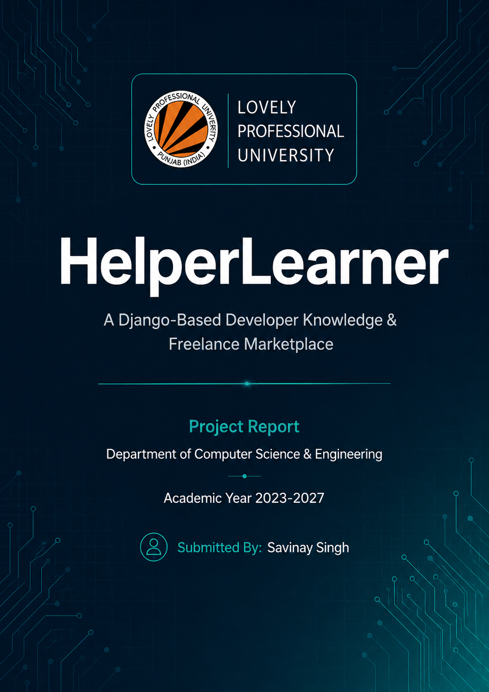
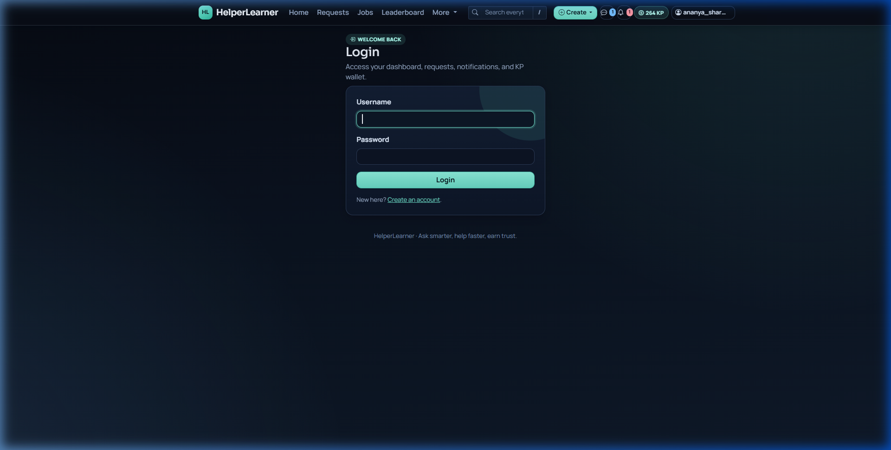
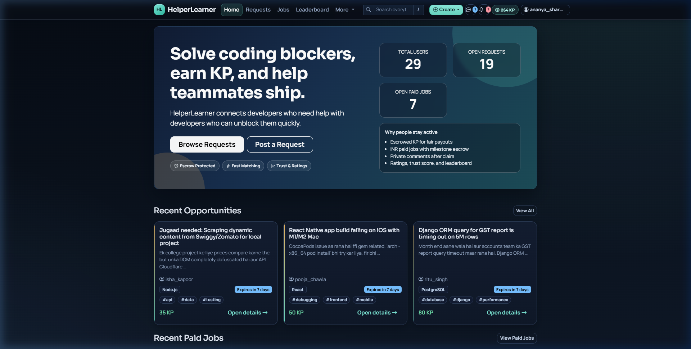
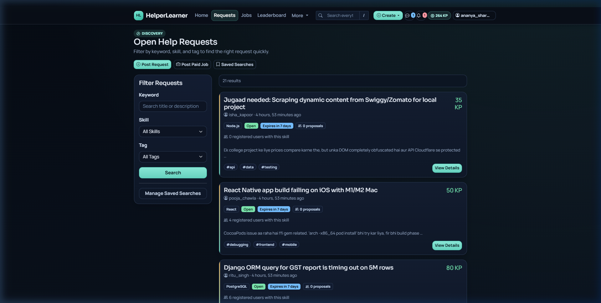
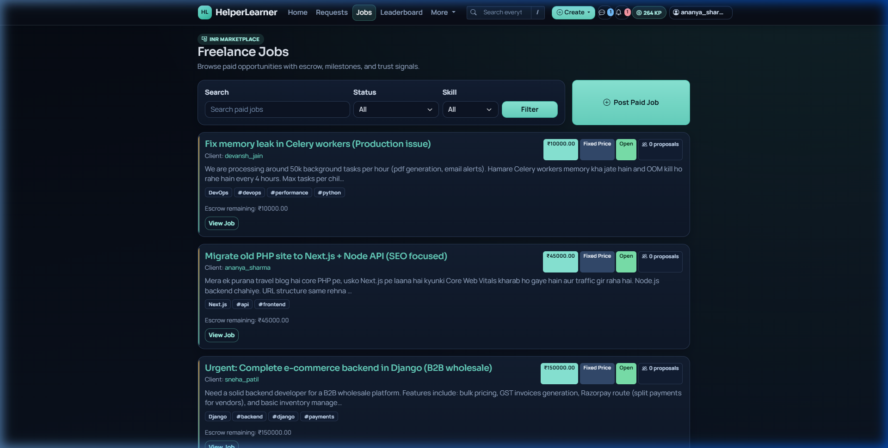

# HelperLearner Formal Project Report

## Project Title
HelperLearner: A Django-Based Developer Knowledge Marketplace

## Abstract
HelperLearner is a full-stack marketplace that connects developers who need help with those who can provide it. The platform supports two core economic flows: knowledge-point based help requests and INR-based freelance jobs with escrow-style milestone payments. It combines real-time communication, AI-assisted matching and moderation, trust scoring, searchable content, and workspace collaboration into one system.

This report summarizes the project goals, architecture, major features, data design, implementation approach, testing strategy, and deployment model in a format suitable for academic submission or internal project review.

## 1. Introduction
Modern software teams and independent developers often struggle with fragmented support channels, delayed feedback, and unreliable freelancing workflows. HelperLearner addresses these issues by providing a structured environment where developers can post problems, offer solutions, manage paid jobs, and collaborate in workspaces.

## 2. Problem Statement
The project targets two related gaps:

1. Developers frequently need fast, reliable help but lack a trusted marketplace for technical problem solving.
2. Freelance coding work often lacks clear milestones, secure payments, and transparent reputation signals.

HelperLearner combines these two experiences into one platform with reputation controls, moderation, payment workflows, and real-time communication.

## 3. Objectives
The project objectives are:

- Enable users to post help requests and reward solvers with Knowledge Points.
- Enable clients to post freelance jobs and pay contractors in INR.
- Support safe collaboration through chat, workspaces, and trust scoring.
- Reduce low-quality or harmful content through automated moderation.
- Provide an extensible architecture suitable for future feature growth.

## 4. Scope
HelperLearner includes the following major modules:

- User management and profiles.
- Help request marketplace.
- Freelance job marketplace.
- KP wallet and INR wallet flows.
- Milestones and escrow payments.
- Real-time chat and notifications.
- Workspace and sprint management.
- AI-based matching and moderation.
- Search, ratings, and trust signals.

## 5. Technology Stack
The implementation uses:

- Python 3.12
- Django 6.0.2
- Django REST Framework 3.16
- Django Channels 4.3
- PostgreSQL 16
- Redis 5.2
- Celery 5.4
- Razorpay 2.0
- Google Gemini API
- Docker and docker-compose
- Render.com for deployment

## 6. Architecture Summary
HelperLearner follows a three-tier architecture:

- Presentation layer: HTML pages, templates, REST endpoints, and WebSocket consumers.
- Business logic layer: marketplace services, trust scoring, moderation, payments, search, and notifications.
- Data and services layer: PostgreSQL, Redis, Celery workers, Razorpay, Gemini, and storage for media assets.

This separation keeps the system maintainable and supports independent evolution of user interfaces, business workflows, and infrastructure services.

## 7. Core Features
### 7.1 Help Requests
Users post technical issues with Knowledge Point bounties. Other users can claim, answer, and earn KP based on contribution quality and trust signals.

### 7.2 Freelance Jobs
Clients create paid jobs, define milestones, and fund payments through an escrow-like workflow before contractor approval.

### 7.3 Knowledge Point Economy
KP is an internal currency used to incentivize helpful contributions and make knowledge exchange measurable.

### 7.4 Real-Time Communication
WebSocket chat supports immediate coordination around help requests, jobs, and workspace issues.

### 7.5 Workspaces
Workspaces provide project collaboration features such as boards, tasks, sprints, and issue tracking.

### 7.6 AI Assistance
Gemini-based features help summarize requests, support helper matching, and assist moderation.

### 7.7 Trust and Moderation
The platform combines ratings, activity, compliance checks, and signal-based scoring to reduce abuse and improve quality.

## 8. UI Screenshots

The following screenshots illustrate the key interfaces of the HelperLearner platform. The UI uses a dark theme with teal/cyan accent colors for a modern, developer-friendly aesthetic.

### Figure 1: Login Page
The login page provides a clean authentication interface with username and password fields, a registration link, and the platform tagline.

### Figure 2: Home / Dashboard
The home dashboard displays platform-wide statistics (total users, open requests, open paid jobs), value propositions, and a feed of recent opportunities and paid jobs.

### Figure 3: Browse Help Requests
The help request browser features a filter sidebar (keyword, skill, tag) and paginated request cards showing title, poster, KP bounty, difficulty tags, and expiry countdown.

### Figure 4: Freelance Jobs Marketplace
The jobs page shows freelance postings with INR budgets, skill requirements, escrow balances, and proposal counts. Clients can post jobs and contractors can filter and apply.

## 9. Data Model Summary
The database is normalized and centered around these entities:

- CustomUser for identity and wallet data.
- HelpRequest and Solution for problem-solving flows.
- FreelanceJob, Proposal, Milestone, and EscrowTransaction for paid work.
- ChatThread and ChatMessage for communication.
- Workspace, Sprint, and Issue for collaboration.
- TrustSignal, Rating, ContentFlag, and AIAssistanceLog for quality, safety, and observability.

Relationships are primarily implemented through foreign keys and many-to-many links where the business rules require shared membership or tagging.

## 10. API and Interaction Model
The project exposes REST endpoints for account operations, help requests, freelance jobs, payments, search, notifications, and workspace activity. Real-time events are handled through WebSocket channels for chat and live updates.

The API design prioritizes predictable request/response shapes, clear error handling, and practical authentication for both browser and programmatic access.

## 11. Testing Strategy
The testing approach uses a layered strategy:

- Unit tests for models, services, and utilities.
- Integration tests for workflows such as claiming requests, funding milestones, and notification delivery.
- End-to-end tests for critical user flows.

This ensures the business rules remain stable as the platform evolves.

## 12. Deployment Summary
The current deployment approach is optimized for low operational friction:

- Local development through native Django or Docker Compose.
- Production deployment on Render with managed PostgreSQL and deployment automation.
- Redis and Celery for background processing.

Monitoring and logs are used to support debugging, operational visibility, and reliability.

## 13. Key Outcomes
HelperLearner delivers:

- A two-sided developer marketplace.
- Secure job and payment workflows.
- Realtime collaboration features.
- AI-enhanced matching and moderation.
- A maintainable Django architecture with production deployment support.

## 14. Challenges and Learning Outcomes
During the development of HelperLearner, several technical and design challenges were overcome, leading to significant learning outcomes:

- **Escrow State Management:** Handling complex state transitions for the escrow system (e.g., timeouts, disputes, Razorpay webhook delays) required learning robust transaction handling and implementing strict SLA tracking.
- **Real-Time Scaling:** Managing concurrent WebSocket connections without dropping messages taught us how to effectively implement and tune Django Channels with Redis as a channel layer.
- **Trust Scoring Design:** Designing a multi-signal trust score that cannot be easily gamed required understanding decay factors and weighted rating algorithms.
- **AI Integration:** Integrating the Gemini API for content moderation highlighted the challenges of latency in third-party API calls, which we resolved by offloading the task to asynchronous Celery workers.

## 15. Conclusion
HelperLearner is a complete example of a modern Django marketplace that blends community help, paid work, trust scoring, and collaboration. Its architecture and documentation make it suitable both as an academic final-year project and as a practical production-oriented platform.

## 16. References
- High level design: [01_HIGH_LEVEL_DESIGN.md](01_HIGH_LEVEL_DESIGN.md)
- Low level design: [02_LOW_LEVEL_DESIGN.md](02_LOW_LEVEL_DESIGN.md)
- Requirements: [03_PROBLEM_STATEMENT_REQUIREMENTS.md](03_PROBLEM_STATEMENT_REQUIREMENTS.md)
- Database schema: [04_DATABASE_SCHEMA.md](04_DATABASE_SCHEMA.md)
- API documentation: [05_API_DOCUMENTATION.md](05_API_DOCUMENTATION.md)
- Testing strategy: [06_TESTING_STRATEGY.md](06_TESTING_STRATEGY.md)
- Setup and deployment: [07_SETUP_DEPLOYMENT_GUIDE.md](07_SETUP_DEPLOYMENT_GUIDE.md)
